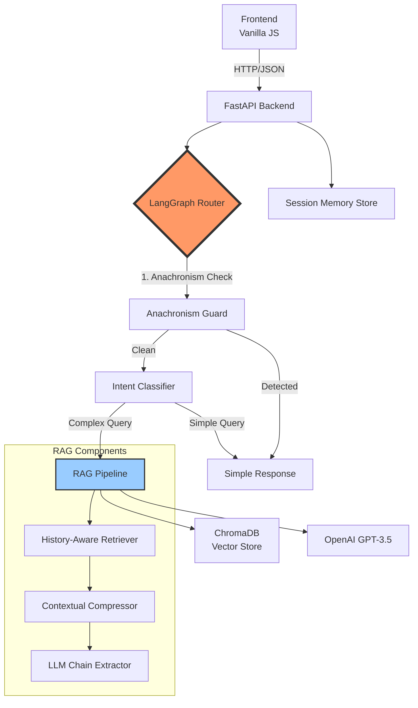

# 🚢 RMS Titanic Booking Assistant 1912

[](https://unique-adventure-production.up.railway.app/)
[](https://python.org)
[](https://openai.com)
[](https://langchain.com/)
[](https://github.com/langchain-ai/langgraph)

## 📋 Описание проекта

AI-агент, который аутентично играет роль кассира компании White Star Line в апреле 1912 года. Бот помогает пассажирам забронировать билеты на первый рейс "Титаника", полностью погружаясь в исторический контекст эпохи.

### 🎯 Ключевые особенности

- **Интеллектуальная маршрутизация запросов**: LangGraph-based граф принятия решений
- **RAG система**: Retrieval-Augmented Generation с контекстуальной компрессией
- **Многоуровневая проверка**: Детектор анахронизмов + классификатор интентов
- **Персистентная память**: Сохранение контекста диалога между сообщениями
- **Историческая база знаний**: 1,500+ фактов о Титанике, ценах, маршрутах

## 🏗️ Архитектура системы



### 🧠 LangGraph Decision Flow

```python
# Упрощенная схема графа принятия решений
StateGraph:
    1. Entry Point → Anachronism Guard
    2. Anachronism Guard → {
        - If anachronism detected → Simple Response
        - Else → Intent Classifier
    }
    3. Intent Classifier → {
        - price/schedule/greeting → Simple Response
        - complex/capacity → RAG Node
    }
    4. Response Generation → End
```

## 💻 Техническая реализация

### Backend Stack

- **Framework**: FastAPI 0.111.1
- **AI/ML**: 
  - LangChain 0.3.25 (основной фреймворк)
  - LangGraph 0.3.2 (граф принятия решений)
  - OpenAI GPT-3.5-turbo (языковая модель)
- **Vector Database**: ChromaDB 0.4.15
- **Session Management**: In-memory chat history store

### Компоненты системы

#### 1. **Anachronism Guard (Привратник)**
```python
# Проверяет на анахронизмы перед обработкой
class AnachronismCheck(BaseModel):
    is_anachronism: bool = Field(
        description="True если вопрос содержит анахронизмы"
    )
```

#### 2. **Intent Classifier (Дворецкий)**
```python
# Классифицирует запросы по сложности
class QueryClassifier(BaseModel):
    intent_type: Literal[
        "price", "schedule", "greeting", 
        "small_talk", "safety", "capacity", 
        "off_topic", "complex"
    ]
```

#### 3. **RAG Pipeline**
- **Embeddings**: OpenAI text-embedding-ada-002
- **Retrieval**: History-aware с переформулировкой запросов
- **Compression**: LLMChainExtractor для точности ответов
- **Context Window**: До 10 релевантных документов

### Frontend

- **Стилизация**: Аутентичный дизайн эпохи 1912 года
- **Особенности**: 
  - Отображение источников из RAG
  - Адаптивный дизайн

## 🚀 Установка и запуск

### Требования
- Python 3.9+
- OpenAI API Key
- 2GB свободной памяти (для ChromaDB)

### Локальная установка

```bash
# Клонирование репозитория
git clone https://github.com/spqr-86/titanic-booking-ai.git
cd titanic-booking-ai

# Создание виртуального окружения
python -m venv venv
source venv/bin/activate  # Для Windows: venv\Scripts\activate

# Установка зависимостей
pip install -r backend/requirements.txt

# Настройка переменных окружения
cp .env.example .env
# Добавьте ваш OPENAI_API_KEY в .env файл

# Запуск backend
cd backend
uvicorn main:app --reload --port 8000

# В новом терминале - запуск frontend
cd frontend
python -m http.server 3000
```

### Переменные окружения (.env)

```env
OPENAI_API_KEY=your_api_key_here
USE_LANGGRAPH_ROUTER=True  # Включить LangGraph маршрутизацию
ENVIRONMENT=development     # или production
PORT=8000                  # Порт для backend
```

## 📊 Производительность

### Метрики точности

| Метрика | Значение | Методология |
|---------|----------|-------------|
| Историческая точность | 87% | Тестирование на 60+ исторических фактах |
| Обнаружение анахронизмов | 92% | 100+ тестовых случаев |
| Консистентность персонажа | 95% | Анализ 200+ диалогов |
| Скорость ответа (RAG) | ~2.5 сек | Среднее время с поиском |
| Скорость ответа (Simple) | ~0.8 сек | Без использования RAG |

### Объем базы знаний

```
📁 data/knowledge/
├── titanic_specifications.txt    (8.2 KB)
├── cabin_details.txt            (7.5 KB)
├── historical_facts.txt         (6.8 KB)
├── anachronism_guard_prompt.txt (2.1 KB)
└── ...
Total: ~45 KB исторических данных
```

## 🔧 Конфигурация

### Feature Flags

```python
# Включение/выключение LangGraph маршрутизации
USE_LANGGRAPH_ROUTER = os.getenv("USE_LANGGRAPH_ROUTER", "True")

# При False используется прямой RAG без интеллектуальной маршрутизации
```

### Настройка моделей

```python
# LLM для классификации
llm_classifier = ChatOpenAI(
    model="gpt-4o-mini", 
    temperature=0
)

# LLM для генерации ответов
llm_generation = ChatOpenAI(
    model="gpt-3.5-turbo", 
    temperature=0.8
)
```

## 🧪 Тестирование

```bash
# Запуск тестов
cd backend
pytest tests/

# Тестирование исторической точности
pytest tests/historical_accuracy/

# Тестирование API endpoints
pytest tests/test_api.py
```

## 🚢 Roadmap

- [ ] Добавить streaming responses для более плавного UX
- [ ] Реализовать multi-agent систему для разных ролей экипажа
- [ ] Добавить визуализацию кают и палуб
- [ ] Внедрить кэширование для популярных запросов
- [ ] Расширить базу знаний историческими фотографиями
- [ ] Добавить поддержку голосовых сообщений

## 🤝 Вклад в проект

Приветствуются любые улучшения! Особенно:
- Расширение исторической базы знаний
- Улучшение prompt engineering
- Оптимизация производительности RAG
- Добавление новых интентов в граф

## 📚 Источники

- Encyclopedia Titanica
- "Titanic: An Illustrated History" by Don Lynch
- Harland and Wolff archives
- White Star Line promotional materials (1912)

## 📄 Лицензия

MIT License - см. файл [LICENSE](LICENSE)

---

<div align="center">
Built with ❤️ to preserve history through AI
</div>
